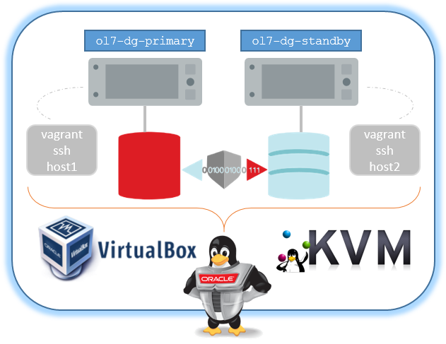

# Oracle Data Guard (DG) Vagrant project on VirtualBox or KVM/libVirt provider

###### Author: Ruggero Citton (<ruggero.citton@oracle.com>) - Oracle RAC Pack, Cloud Innovation and Solution Engineering Team

This directory contains Vagrant build files to provision automatically
two Oracle RDBMS (18c, 19c) hosts configured with Oracle Data Guard, using Vagrant, Oracle Linux 7 and shell scripts.

The virtualization provider can be VirtualBox or KVM/libVirt

## Prerequisites

1. Read the [prerequisites in the top level README](../README.md#prerequisites) to set up Vagrant with either VirtualBox or KVM
1. You need to download Database binary separately

## Free disk space requirement

- Database binary zip under "./ORCL_software": ~3.2 Gb
- Database binary on u01 vdisk (node1/node2) : ~10 Gb
- OS guest vdisk (node1/node2): ~2 Gb
  - In case of KVM/libVirt provider, the disks are created under `storage pool = "storage_pool_name"`
  - In case of VirtualBox
    - Use `VBoxManage list systemproperties |grep folder` to find out the current VM default location
    - Use `VBoxManage setproperty machinefolder <your path>` to set VM default location
- Database DBFs virtual disks (dynamic size): ~80 Gb

## Memory requirement

Running two RDBMS nodes at least 6Gb per node are required

## Getting started

1. Clone this repository `git clone https://github.com/oracle/vagrant-projects.git`
2. Change into OracleDG folder (`/repo clone path/vagrant-projects/RACPack/OracleDG`)
3. Download Database binary from OTN into `./ORCL_software` folder (*)
4. Run `vagrant up`
5. Connect the hosts issuing: `vagrant ssh host1/2`.
6. You can shut down the VM via the usual `vagrant halt` and the start it up again via `vagrant up`

(*) Download Database binary from OTN into `ORCL_software` folder
https://www.oracle.com/technetwork/database/enterprise-edition/downloads/index.html

    Accept License Agreement
    go to version (18c, 19c) for Linux x86-64 you need -> "See All", example

    * Oracle Database 19c (19.3) for Linux x86-64
       LINUX.X64_193000_db_home.zip (4,564,649,047 bytes)
       (sha256sum - ba8329c757133da313ed3b6d7f86c5ac42cd9970a28bf2e6233f3235233aa8d8)

## Customization

You can customize your Oracle environment by amending the parameters in the configuration file: `./config/vagrant.yml`
The following can be customized:

#### node1/node2

- `vm_name`:           VM Guest partial name. The full name will be <prefix_name>-<vm_name>
- `mem_size`:          VM Guest memory size Mb (minimum 6Gb --> 6144)
- `cpus`:              VM Guest virtual cores
- `public_ip`:         VM public ip. VirtualBox `vboxnet0` hostonly is in use
- `private_ip`:        VM private ip.
- `storage_pool_name`: KVM/libVirt storage pool name
- `u01_disk`:          VirtualBox Oracle binary virtual disk (u01) file path

#### DB storage

- `storage_pool_name`: KVM/libVirt Oradata dbf KVM storage pool name
- `oradata_disk_path`: VirtualBox Oradata dbf path
- `oradata_disk_num` : Oradata number of disks
- `oradata_disk_size`: oradata disk size (Gb)

#### environment

- `provider`:           It's defining the provider to be used: 'libvirt' or 'virtualbox'
- `prefix_name`:        VM Guest prefix name
- `domain`:             VM Guest domain name
- `db_software`:        Oracle Database for Linux x86-64 zip file
- `root_password`:      VM Guest root password
- `oracle_password`:    VM Guest oracle password
- `sys_password`:       Oracled RDBMS SYS password
- `pdb_password`:       Oracled PDB SYS password
- `ora_languages`:      Oracle products languages
- `db_name`:            Oracle RDBMS database name
- `pdb_name`:           Oracle RDBMS pluggable database name
- `db_type`:            Oracle RDBMS type: RAC, RACONE, SI (single Instance)
- `cdb`:                Oracle RDBMS database created as container (true/false)
- `adg`:                Oracle Standby created as Active Standby (ADG) (true/false)

#### VirtualBox provider Example:

    host1:
      vm_name: primary
      mem_size: 8192
      cpus: 2
      public_ip:  192.168.56.131
      private_ip: 192.168.200.131
      u01_disk: ./primary_u01.vdi

    host2:
      vm_name: standby
      mem_size: 8192
      cpus: 2
      public_ip:  192.168.56.132
      private_ip: 192.168.200.132
      u01_disk: ./standby_u01.vdi

    env:
      provider: virtualbox
      # ---------------------------------------------
      prefix_name: ol7-dg
      # ---------------------------------------------
      domain: localdomain
      # ---------------------------------------------
      non_rotational: 'on'
      oradata_disk_path:
      oradata_disk_num:   2
      oradata_disk_size: 20
      # ---------------------------------------------
      db_software: LINUX.X64_193000_db_home.zip
      # ---------------------------------------------
      root_password:   welcome1
      oracle_password: welcome1
      sys_password:    welcome1
      pdb_password:    welcome1
      # ---------------------------------------------
      ora_languages:   en,en_GB
      # ---------------------------------------------
      db_name:         DB193H1
      pdb_name:        PDB1
      cdb:             false
      adg:             false
      # ---------------------------------------------

#### KVM/libVirt provider Example:

    host1:
      vm_name: primary
      mem_size: 8192
      cpus: 2
      public_ip:  192.168.125.131
      private_ip: 192.168.200.131
      storage_pool_name: Vagrant_KVM_Storage

    host2:
      vm_name: standby
      mem_size: 8192
      cpus: 2
      public_ip:  192.168.125.132
      private_ip: 192.168.200.132
      storage_pool_name: Vagrant_KVM_Storage

    env:
      provider: libvirt
      # ---------------------------------------------
      prefix_name: vgt-ol7-dg
      # ---------------------------------------------
      domain: localdomain
      # ---------------------------------------------
      oradata_disk_num:   2
      oradata_disk_size: 20
      storage_pool_name: Vagrant_KVM_Storage
      # ---------------------------------------------
      db_software:     LINUX.X64_193000_db_home.zip
      # ---------------------------------------------
      root_password:   welcome1
      oracle_password: welcome1
      sys_password:    welcome1
      pdb_password:    welcome1
      # ---------------------------------------------
      ora_languages:   en,en_GB
      # ---------------------------------------------
      db_name:         DB193H1
      pdb_name:        PDB1
      cdb:             false
      adg:             false
      # ---------------------------------------------

## Running scripts after setup

You can have the installer run scripts after setup by putting them in the `userscripts` directory below the directory where you have this file checked out. Any shell (`.sh`) or SQL (`.sql`) scripts you put in the `userscripts` directory will be executed by the installer after the database is set up and started. Only shell and SQL scripts will be executed; all other files will be ignored. These scripts are completely optional.
Shell scripts will be executed as the root user, which has sudo privileges. SQL scripts will be executed as SYS.
To run scripts in a specific order, prefix the file names with a number, e.g., `01_shellscript.sh`, `02_tablespaces.sql`, `03_shellscript2.sh`, etc.

## Note

- `SYSTEM_TIMEZONE`: `automatically set (see below)`
  The system time zone is used by the database for SYSDATE/SYSTIMESTAMP.
  The guest time zone will be set to the host time zone when the host time zone is a full hour offset from GMT.
  When the host time zone isn't a full hour offset from GMT (e.g., in India and parts of Australia), the guest time zone will be set to UTC.
  You can specify a different time zone using a time zone name (e.g., "America/Los_Angeles") or an offset from GMT (e.g., "Etc/GMT-2"). For more information on specifying time zones, see [List of tz database time zones](https://en.wikipedia.org/wiki/List_of_tz_database_time_zones).
- Wallet Zip file location `/tmp/wallet_<pdb name>.zip`.
  Copy the file on client machine, unzip and set TNS_ADMIN to Wallet loc. Connect to DB using Oracle Sql Client or using your App
- Using KVM/libVirt provider you may need add a firewall rule to permit NFS shared folder mounted on the guest

    example: using 'uwf' : `sudo ufw allow to 192.168.121.1` where 192.168.121.1 is the IP for the `vagrant-libvirt` network (created by vagrant automatically)

      virsh net-dumpxml vagrant-libvirt
      <network connections='1' ipv6='yes'>
        <name>vagrant-libvirt</name>
        <uuid>d2579032-4e5e-4c3f-9d42-19b6c64ac609</uuid>
        <forward mode='nat'>
          <nat>
            <port start='1024' end='65535'/>
          </nat>
        </forward>
        <bridge name='virbr1' stp='on' delay='0'/>
        <mac address='52:54:00:05:12:14'/>
        <ip address='192.168.121.1' netmask='255.255.255.0'>
          <dhcp>
            <range start='192.168.121.1' end='192.168.121.254'/>
          </dhcp>
        </ip>
      </network>
- If you are behind a proxy, set the following env variables
  - (Linux/MacOSX)
    - export http_proxy=http://proxy:port
    - export https_proxy=https://proxy:port
  - (Windows)
    - set http_proxy=http://proxy:port
    - set https_proxy=https://proxy:port
