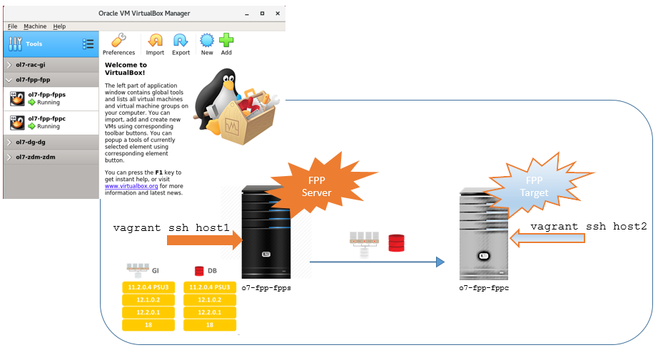

# Oracle Fleet Patching and Provisioning (FPP) Vagrant project on VirtualBox or KVM/libVirt provider

###### Author: Ruggero Citton (<ruggero.citton@oracle.com>) - Orale RAC Pack, Cloud Innovation and Solution Engineering Team

This directory contains Vagrant build files to provision automatically
one Grid Infrastructure and FPP Server host + (optional) an Oracle FPP target, using Vagrant, Oracle Linux 7.4 and shell scripts.

## Prerequisites

1. Read the [prerequisites in the top level README](../README.md#prerequisites) to set up Vagrant with either VirtualBox or KVM
1. You need to download Database binary separately

## Free disk space requirement

- Grid Infrastructure and Database binary zip under "./ORCL_software": ~9.3 Gb
- Grid Infrastructure on u01 vdisk (node1, location set by `u01_disk`): ~7 Gb
- OS guest vdisk (node1/node2) located on default VirtualBox VM location: ~2.5 Gb
  - In case of KVM/libVirt provider, the disk is created under `storage pool = "storage_pool_name"`
  - In case of VirtualBox
    - Use `VBoxManage list systemproperties |grep folder` to find out the current VM default location
    - Use `VBoxManage setproperty machinefolder <your path>` to set VM default location
- Dynamically allocated storage for ASM shared virtual disks (node1, location set by `asm_disk_path`): ~24 Gb

#### Extra Steps when KVM/libVirt provider is in use:

1. Install Vagrant plugin `vagrant-mutate`:
        vagrant plugin install vagrant-mutate
2. If not done, add ol7.4 vagrant box for virtualbox:
        vagrant box add --provider virtualbox https://yum.oracle.com/boxes/oraclelinux/ol74/ol74.box --name ol74
3. Check for the new  vagrant box availability:
        vagrant box list
        ol7-latest    (libvirt, 0)
        ol7-latest    (virtualbox, 0)
        ol74          (virtualbox, 0)    <<<---- (!)
        oraclelinux/7 (libvirt, 7.7.17)
4. Convert ol7.4 box to libvirt
        vagrant mutate ol74 libvirt
5. Check for the new  vagrant box availability:
        vagrant box list
        ol7-latest    (libvirt, 0)
        ol7-latest    (virtualbox, 0)
        ol74          (libvirt, 0)      <<<---- (!)
        ol74          (virtualbox, 0)
        oraclelinux/7 (libvirt, 7.7.17)

## Memory requirement

- Deploy one Grid Infrastructure and FPP Server (host1) at least 12Gb are required
- Deploy OL7 host2 (optional) as Oracle FPP target at least 6Gb are required

## Getting started

1. Clone this repository `git clone https://github.com/oracle/vagrant-projects.git`
2. Change into OracleFPP folder (`/repo clone path/vagrant-projects/RACPack/OracleFPP`)
3. Download Grid Infrastructure and Database (optional) binary from OTN into `./ORCL_software` folder (*)
4. Run `vagrant up`
5. Connect to Oracle FPP Server (node1).
6. You can shut down the VM via the usual `vagrant halt` and the start it up again via `vagrant up`.

(*) Download Grid Infrastructure and Database binary from OTN into `ORCL_software` folder
https://www.oracle.com/technetwork/database/enterprise-edition/downloads/index.html

    Accept License Agreement
    go to version (19c) for Linux x86-64 you need -> "See All", example

    * Oracle Database 19c Grid Infrastructure (19.3) for Linux x86-64
        LINUX.X64_193000_grid_home.zip (3,059,705,302 bytes)
        (sha256sum - d668002664d9399cf61eb03c0d1e3687121fc890b1ddd50b35dcbe13c5307d2e)

    * Oracle Database 19c (19.3) for Linux x86-64 (optional)
       LINUX.X64_193000_db_home.zip (4,564,649,047 bytes)
       (sha256sum - ba8329c757133da313ed3b6d7f86c5ac42cd9970a28bf2e6233f3235233aa8d8)

## Customization

You can customize your Oracle environment by amending the parameters in the configuration file: `./config/vagrant.yml`
The following can be customized:

#### host1

- `vm_name`          : VM Guest partial name. The full name will be <prefix_name>-<vm_name>
- `mem_size`         : VM Guest memory size Mb (minimum 12Gb --> 12288)
- `cpus`             : VM Guest virtual cores
- `public_ip`        : VM public ip.
- `vip_ip`           : Oracle RAC VirtualIP (VIP).
- `private_ip`       : VM private ip
- `scan_ip1`         : Oracle RAC SCAN IP1
- `scan_ip2`         : Oracle RAC SCAN IP2
- `scan_ip3`         : Oracle RAC SCAN IP3
- `gns_IP`           : Oracle RAC GNS (FPP requirement)
- `ha_vip`           : Oracle RAC HA_VIP (FPP requirement)
- `storage_pool_name`: KVM/libVirt storage pool name
- `u01_disk`:          VirtualBox Oracle binary virtual disk (u01) file path

#### host2

- `vm_name`          : VM Guest partial name. The full name will be <prefix_name>-<vm_name>
- `mem_size`         : VM Guest memory size Mb (minimum 6Gb --> 6144)
- `cpus`             : VM Guest virtual cores
- `public_ip`        : VM public ip.
- `storage_pool_name`: KVM/libVirt storage pool name
- `u01_disk`:          VirtualBox Oracle binary virtual disk (u01) file path
- `deploy`           : It can be 'true' or 'false'. Using false node2 deploy will be skipped.

#### shared network

- `prefix_name`      : VM Guest prefix name (the GI cluster name will be: <prefix_name>-c')
- `network`          : It can be 'hostonly' or 'public'.
  - In case of 'hostonly', the guest VMs are using "host-Only" network defined as 'vboxnet0'
  - In case of 'public' a bridge network will be setup ('netmask' and 'gateway' are required). During startup the bridge network is required
- `bridge_nic`       : KVM/libVirt bridge NIC, required in case of 'public' network
- `netmask`          : Required in case of 'public' network
- `gateway`          : Required in case of 'public' network
- `dns_public_ip`    : Required in case of 'public' network
- `domain`           : VM Guest domain name

#### shared storage

- `storage_pool_name`: KVM/libVirt Oradata dbf KVM storage pool name
- `oradata_disk_path`: VirtualBox Oradata dbf path
- `asm_disk_num`     : Oracle RAC Automatic Storage Manager virtual disk number (min 4)
- `asm_disk_size`    : Oracle RAC Automatic Storage Manager virtual disk (max) size in Gb (at least 10)

#### environment

- `provider`         : It's defining the provider to be used: 'libvirt' or 'virtualbox'
- `grid_software`    : Oracle Database 18c Grid Infrastructure (18.3) for Linux x86-64 zip file (or above)
- `root_password`    : VM Guest root password
- `grid_password`    : VM Guest grid password
- `oracle_password`  : VM Guest oracle password
- `sys_password`     : Oracled RDBMS SYS password
- `ora_languages`    : Oracle products languages
- `asm_lib_type`     : ASM library in use (ASMLIB/AFD)

#### Virtualbox provider Example1 (Oracle FPP Server available on host-only Virtualbox network):

    host1:
      vm_name: fpps
      mem_size: 16384
      cpus: 1
      private_ip:    192.168.200.101
      public_ip:     192.168.56.101
      vip_ip:        192.168.56.102
      scan_ip1:      192.168.56.105
      scan_ip2:      192.168.56.106
      scan_ip3:      192.168.56.107
      gns_ip:        192.168.56.108
      ha_vip:        192.168.56.109
      storage_pool_name: Vagrant_KVM

    host2:
      vm_name: fppc
      mem_size: 8192
      cpus: 1
      public_ip:  192.168.56.201
      storage_pool_name: Vagrant_KVM
      deploy: 'true'

    shared:
      prefix_name: ol7-fpp
      # ---------------------------------------------
      network: hostonly
      domain: localdomain
      # ---------------------------------------------
      non_rotational: 'on'
      asm_disk_num:   8
      asm_disk_size: 10
      storage_pool_name: Vagrant_KVM
      # ---------------------------------------------

    env:
      provider: virtualbox
      # ---------------------------------------------
      gi_software: LINUX.X64_193000_grid_home.zip
      # ---------------------------------------------
      root_password:   welcome1
      grid_password:   welcome1
      oracle_password: welcome1
      sys_password:    welcome1
      # ---------------------------------------------
      ora_languages:   en,en_GB
      # ---------------------------------------------

#### Virtualbox provider Example2: (Oracle FPP Server available on public network):

    host1:
      vm_name: fpps
      mem_size: 16384
      cpus: 2
      public_ip:  10.0.0.101
      vip_ip:     10.0.0.102
      scan_ip1:   10.0.0.105
      scan_ip2:   10.0.0.106
      scan_ip3:   10.0.0.107
      gns_ip:     10.0.0.108
      ha_vip:     10.0.0.109
      private_ip: 192.168.200.101
      storage_pool_name: Vagrant_KVM

    host2:
      vm_name: fppc
      mem_size: 8192
      cpus: 1
      public_ip:  10.0.0.201
      storage_pool_name: Vagrant_KVM
      deploy: 'false'

    shared:
      prefix_name:   vgt-ol7-fpp
      # ---------------------------------------------
      network:       public
      netmask:       255.255.255.0
      gateway:       10.0.0.1
      dns_public_ip: 8.8.8.8
      domain:        mydomain.it
      # ---------------------------------------------
      non_rotational: 'on'
      asm_disk_num: 4
      asm_disk_size: 200
      storage_pool_name: Vagrant_KVM
      # ---------------------------------------------

    env:
      provider: virtualbox
      # ---------------------------------------------  
      gi_software: LINUX.X64_193000_grid_home.zip
      # ---------------------------------------------
      root_password:   welcome1
      grid_password:   welcome1
      oracle_password: welcome1
      sys_password:    welcome1
      # ---------------------------------------------
      ora_languages:   en,en_GB
      # ---------------------------------------------

#### KVM/libVirt provider Example1 (Oracle FPP Server and FPP target on private network):

    host1:
      vm_name: fpps
      mem_size: 16384
      cpus: 1
      private_ip:    192.168.200.101
      public_ip:     192.168.125.101
      vip_ip:        192.168.125.102
      scan_ip1:      192.168.125.105
      scan_ip2:      192.168.125.106
      scan_ip3:      192.168.125.107
      gns_ip:        192.168.125.108
      ha_vip:        192.168.125.109
      storage_pool_name: Vagrant_KVM_Storage

      host2:
      vm_name: fppc
      mem_size: 8192
      cpus: 1
      public_ip:  192.168.125.201
      storage_pool_name: Vagrant_KVM_Storage
      deploy: 'true'

      shared:
      prefix_name:   vgt-ol7-fpp
      # ---------------------------------------------
      network: hostonly
      domain: localdomain
      # ---------------------------------------------
      asm_disk_num:   8
      asm_disk_size: 10
      storage_pool_name: Vagrant_KVM_Storage
      # ---------------------------------------------

      env:
      provider: libvirt
      # ---------------------------------------------
      gi_software: LINUX.X64_193000_grid_home.zip
      # ---------------------------------------------
      root_password:   welcome1
      grid_password:   welcome1
      oracle_password: welcome1
      sys_password:    welcome1
      # ---------------------------------------------
      ora_languages:   en,en_GB
      # ---------------------------------------------

#### KVM/libVirt provider Example1 (Oracle FPP Server and FPP target on public network):

    host1:
      vm_name: fpps
      mem_size: 16384
      cpus: 1
      private_ip:    192.168.200.101
      public_ip:     192.168.125.101
      vip_ip:        192.168.125.102
      scan_ip1:      192.168.125.105
      scan_ip2:      192.168.125.106
      scan_ip3:      192.168.125.107
      gns_ip:        192.168.125.108
      ha_vip:        192.168.125.109
      storage_pool_name: Vagrant_KVM_Storage

      host2:
      vm_name: fppc
      mem_size: 8192
      cpus: 1
      public_ip:  192.168.125.201
      storage_pool_name: Vagrant_KVM_Storage
      deploy: 'true'

      shared:
      prefix_name:   vgt-ol7-fpp
      # ---------------------------------------------
      network:       hostonly
      bridge_nic:    br0
      netmask:       255.255.255.0
      gateway:       10.0.0.1
      dns_public_ip: 8.8.8.8
      domain:        localdomain
      # ---------------------------------------------
      asm_disk_num:   8
      asm_disk_size: 10
      storage_pool_name: Vagrant_KVM_Storage
      # ---------------------------------------------

      env:
      provider: libvirt
      # ---------------------------------------------
      gi_software: LINUX.X64_193000_grid_home.zip
      # ---------------------------------------------
      root_password:   welcome1
      grid_password:   welcome1
      oracle_password: welcome1
      sys_password:    welcome1
      # ---------------------------------------------
      ora_languages:   en,en_GB
      # ---------------------------------------------

## Note

- `SYSTEM_TIMEZONE`: `automatically set (see below)`
  The system time zone is used by the database for SYSDATE/SYSTIMESTAMP.
  The guest time zone will be set to the host time zone when the host time zone is a full hour offset from GMT.
  When the host time zone isn't a full hour offset from GMT (e.g., in India and parts of Australia), the guest time zone will be set to UTC.
  You can specify a different time zone using a time zone name (e.g., "America/Los_Angeles") or an offset from GMT (e.g., "Etc/GMT-2"). For more information on specifying time zones, see [List of tz database time zones](https://en.wikipedia.org/wiki/List_of_tz_database_time_zones).
- Wallet Zip file location `/tmp/wallet_<pdb name>.zip`.
  Copy the file on client machine, unzip and set TNS_ADMIN to Wallet loc. Connect to DB using Oracle Sql Client or using your App
- Using KVM/libVirt provider you may need add a firewall rule to permit NFS shared folder mounted on the guest

    example: using 'uwf' : `sudo ufw allow to 192.168.121.1` where 192.168.121.1 is the IP for the `vagrant-libvirt` network (created by vagrant automatically)

      virsh net-dumpxml vagrant-libvirt
      <network connections='1' ipv6='yes'>
        <name>vagrant-libvirt</name>
        <uuid>d2579032-4e5e-4c3f-9d42-19b6c64ac609</uuid>
        <forward mode='nat'>
          <nat>
            <port start='1024' end='65535'/>
          </nat>
        </forward>
        <bridge name='virbr1' stp='on' delay='0'/>
        <mac address='52:54:00:05:12:14'/>
        <ip address='192.168.121.1' netmask='255.255.255.0'>
          <dhcp>
            <range start='192.168.121.1' end='192.168.121.254'/>
          </dhcp>
        </ip>
      </network>
- If you are behind a proxy, set the following env variables
  - (Linux/MacOSX)
    - export http_proxy=http://proxy:port
    - export https_proxy=https://proxy:port

  - (Windows)
    - set http_proxy=http://proxy:port
    - set https_proxy=https://proxy:port

## FPP commands you could test postdeploy based on the configuration file above

Note1 : as you need the Database binaries zip file under "ORCL_software"  
Note2 : having limited resource you may want setup the following JAVA env variables for grid user : `JVM_ARGS="-Xms512m -Xmx512m" and _JAVA_OPTIONS="-XX:ParallelGCThreads=2"` before rhpctl commands executions  
Note3 : you can connect host1/host2 issuing 'vagrant ssh host1/host2'  
Note4 : following some fpp commands you may want to try

- `rhpctl import image -image db_19300 -imagetype ORACLEDBSOFTWARE -zip /vagrant/ORCL_software/LINUX.X64_193000_db_home.zip`
- `rhpctl import image -image gi_19300 -imagetype ORACLEGISOFTWARE -zip /vagrant/ORCL_software/LINUX.X64_193000_grid_home.zip`
- `rhpctl add workingcopy -workingcopy wc_db_19300 -image db_19300 -user oracle -groups OSBACKUP=dba,OSDG=dba,OSKM=dba,OSRAC=dba -oraclebase /u01/app/oracle -path /u01/app/oracle/product/193000/dbhome_1 -targetnode fppc -root`
- `rhpctl add database -workingcopy wc_db_19300 -dbname ORCL -dbtype SINGLE -cdb -pdbName PDB -numberOfPDBs 2 -root`
- (...)
