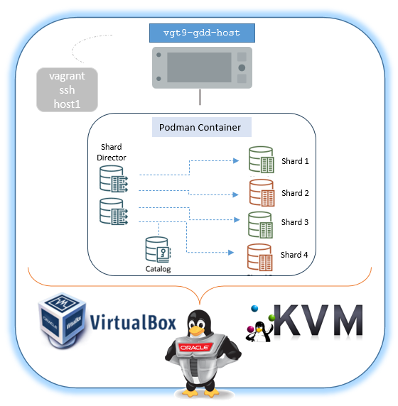

# Oracle Globally Distributed Database (GDD) Vagrant boxes on VirtualBox or KVM/libVirt provider

###### Author: Ruggero Citton (<ruggero.citton@oracle.com>) - Oracle RAC Pack, Cloud Innovation and Solution Engineering Team

This directory contains Vagrant build files to provision automatically
Oracle Globally Distributed Database 23ai for free host, using Vagrant, Oracle Linux 9 and shell scripts.

The virtualization provider can be VirtualBox or KVM/libVirt

## Prerequisites for VirtualBox
1. Install [Oracle VM VirtualBox](https://www.virtualbox.org/wiki/Downloads)
2. Install [Vagrant](https://vagrantup.com/)
3. You need to download Database binary separately

## Prerequisites for KVM/libVirt provider
1. Install [KVM]/[libVirt]
2. Install [Vagrant](https://vagrantup.com/)
3. Install extra packages such ruby-devel libvirt-devel
  - `dnf install -y ruby-devel libvirt-devel`
4. Install vagrant-libvirt as user
  - `vagrant plugin install vagrant-libvirt`
5. You need to download Database binary separately

#### Note: *Using KVM/libVirt provider you may need to disable or manage host firewall to permit NFS traffic with the guest VMs*
#### Note: if you are going to use KVM on OL8/OL9 please read 'https://blogs.oracle.com/linux/getting-started-with-the-vagrant-libvirt-provider-for-oracle-linux'

## Free disk space requirement
- VM OS disk: ~5.5 Gb
- Storage containers disk : ~11 Gb
- Oradata disks: ~30 Gb

## Memory requirement
Running Oracle Globally Distributed Database host at least 32Gb are required

## Getting started
1. Clone this repository `git clone https://github.com/oracle/vagrant-projects.git`
2. Change into OracleGDD folder (`/repo clone path>/vagrant-projects/OracleGDD/<OL8 | OL9>`)
4. Run `vagrant up`
5. Connect the hosts issuing: `vagrant ssh`.
6. You can shut down the box via the usual `vagrant halt` and the start it up again via `vagrant up`

## Customization
You can customize your Oracle environment by amending the parameters in the configuration file: "./config/vagrant.yml"
The following can be customized:

#### node1
- `vm_name`:           VM Guest partial name. The full name will be <prefix_name>-<vm_name>
- `mem_size`:          VM Guest memory size Mb (minimum 32Gb --> 32768)
- `cpus`:              VM Guest virtual cores
- `public_ip`:         VM public ip. VirtualBox `vboxnet0` hostonly is in use
- `storage_pool_name`: KVM/libVirt host storage pool name

#### environment
- `provider`:                 It's defining the provider to be used: 'libvirt' or 'virtualbox'
- `prefix_name`:              VM Guest prefix name
- `network`:                  Hostonly/public
- `netmask`:                  Podman netmask
- `gateway`:                  Podman gateway
- `dns_public_ip`:            Podman DNS public IP
- `domain`:                   Podman domain
- `bridge_nic`:               In case of libvirt provider, bridge nic for the public network
- `storage_pool_name`:        Oradata storage pool name
- `oradata_disk_num` :        Oradata storage disk size
- `oradata_disk_size`:        Oradata storage pool name
- `root_password`:            VM Guest root password
- `sharding_secret`:          Oracle Globally Distributed Database password
- `podman_registry_uri`:      Registry URI
- `podman_registry_user`:     Registry user
- `podman_registry_password`: Registry password
- `sidb_image`:               Oracle Globally Distributed Database 23ai for free image
- `gsm_image`:                Oracle Globally Distributed Manager 23ai for free image

#### VirtualBox provider Example:
    host1:
      vm_name: host1
      mem_size: 32768
      cpus: 2
      public_ip:  192.168.56.60
      sc_disk: ./storage_container.vdi
    
    env:
      provider: virtualbox
      # ---------------------------------------------
      prefix_name: vgt-235-gdd
      # ---------------------------------------------
      network:     hostonly
      netmask:     
      gateway:     
      domain:      localdomain
      # ---------------------------------------------
      dns_public_ip: 192.168.178.1
      # ---------------------------------------------
      oradata_disk_path:
      oradata_disk_num:   2
      oradata_disk_size: 20
      # ---------------------------------------------
      root_password:   welcome1
      sharding_secret: welcome1
      # ---------------------------------------------
      podman_registry_uri: container-registry.oracle.com
      podman_registry_user:
      podman_registry_password:
      # ---------------------------------------------
      sidb_image: container-registry.oracle.com/database/free
      gsm_image: container-registry.oracle.com/database/gsm:latest
      # ----------------------------------------------

#### KVM/libVirt provider Example:
    host1:
      vm_name: host1
      mem_size: 32768
      cpus: 2
      public_ip:  192.168.125.60
      storage_pool_name: Vagrant_KVM_Storage
    
    env:
      provider: libvirt
      # ---------------------------------------------
      prefix_name: vgt-235-gdd
      # ---------------------------------------------
      network:     hostonly
      netmask:     
      gateway:     
      dns_public_ip: 
      domain:      localdomain
      bridge_nic:    
      # ---------------------------------------------
      dns_public_ip: 192.168.178.1
      # ---------------------------------------------
      storage_pool_name: Vagrant_KVM_Storage
      oradata_disk_num:   2
      oradata_disk_size: 20
      # ---------------------------------------------
      root_password:   welcome1
      sharding_secret: welcome1
      # ---------------------------------------------
      podman_registry_uri: container-registry.oracle.com
      podman_registry_user:
      podman_registry_password:
      # ---------------------------------------------
      sidb_image: container-registry.oracle.com/database/free
      gsm_image: container-registry.oracle.com/database/gsm:latest
      # ---------------------------------------------

## Running scripts after setup
You can have the installer run scripts after setup by putting them in the `userscripts` directory below the directory where you have this file checked out. Any shell (`.sh`) or SQL (`.sql`) scripts you put in the `userscripts` directory will be executed by the installer after the database is set up and started. Only shell and SQL scripts will be executed; all other files will be ignored. These scripts are completely optional.
Shell scripts will be executed as the root user, which has sudo privileges. SQL scripts will be executed as SYS.
To run scripts in a specific order, prefix the file names with a number, e.g., `01_shellscript.sh`, `02_tablespaces.sql`, `03_shellscript2.sh`, etc.

## Note
- `SYSTEM_TIMEZONE`: `automatically set (see below)`
  The system time zone is used by the database for SYSDATE/SYSTIMESTAMP.
  The guest time zone will be set to the host time zone when the host time zone is a full hour offset from GMT.
  When the host time zone isn't a full hour offset from GMT (e.g., in India and parts of Australia), the guest time zone will be set to UTC.
  You can specify a different time zone using a time zone name (e.g., "America/Los_Angeles") or an offset from GMT (e.g., "Etc/GMT-2"). For more information on specifying time zones, see [List of tz database time zones](https://en.wikipedia.org/wiki/List_of_tz_database_time_zones).
- Wallet Zip file location `/tmp/wallet_<pdb name>.zip`.
  Copy the file on client machine, unzip and set TNS_ADMIN to Wallet loc. Connect to DB using Oracle Sql Client or using your App
- Using KVM/libVirt provider you may need add a firewall rule to permit NFS shared folder mounted on the guest

    example: using 'uwf' : `sudo ufw allow to 192.168.121.1` where 192.168.121.1 is the IP for the `vagrant-libvirt` network (created by vagrant automatically)

      virsh net-dumpxml vagrant-libvirt
      <network connections='1' ipv6='yes'>
        <name>vagrant-libvirt</name>
        <uuid>d2579032-4e5e-4c3f-9d42-19b6c64ac609</uuid>
        <forward mode='nat'>
          <nat>
            <port start='1024' end='65535'/>
          </nat>
        </forward>
        <bridge name='virbr1' stp='on' delay='0'/>
        <mac address='52:54:00:05:12:14'/>
        <ip address='192.168.121.1' netmask='255.255.255.0'>
          <dhcp>
            <range start='192.168.121.1' end='192.168.121.254'/>
          </dhcp>
        </ip>
      </network>
- If you are behind a proxy, set the following env variables

    #### (Linux/MacOSX)
    - export http_proxy=http://proxy:port
    - export https_proxy=https://proxy:port

    #### (Windows)
    - set http_proxy=http://proxy:port
    - set https_proxy=https://proxy:port
