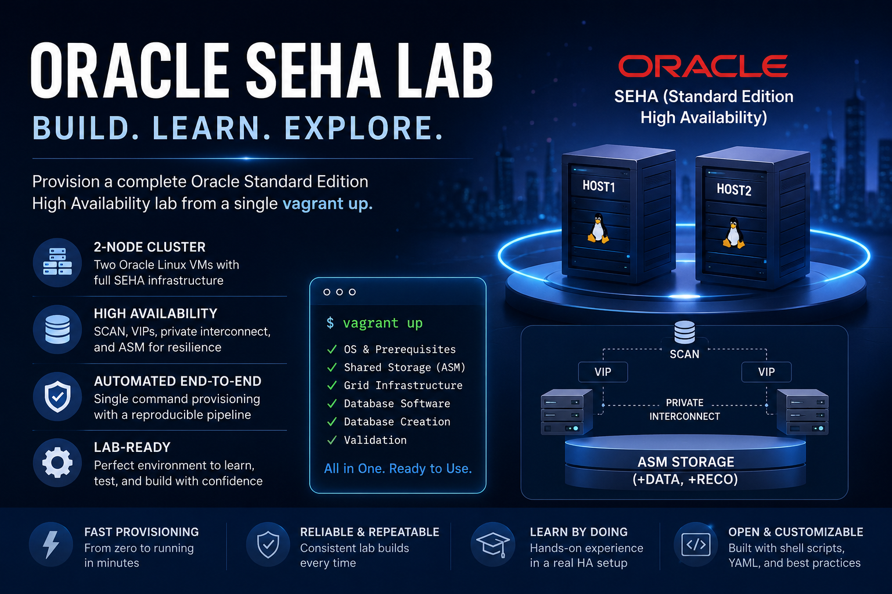

# 🧪 Oracle SEHA Lab
## Oracle Database 21c (21.3.0) on Oracle Linux 8

Provision an Oracle Standard Edition High Availability (SEHA) lab from a single `vagrant up`.

The build is intentionally SEHA-only: a **two-node Grid Infrastructure cluster** running a
**single-instance SE2 database** that Clusterware can relocate between the nodes.

The implementation is opinionated and explicit: it verifies every installer payload up front, lays out `/u01` on its own disk, creates shared ASM storage, performs silent GI and RDBMS installs, creates the database, sets the SEHA failover node list, and then executes optional post-provision hooks from `userscripts/`.



###### Author: Ruggero Citton (<ruggero.citton@oracle.com>) — RAC Pack, Cloud Innovation and Solution Engineering Team

> ⚠️ This is a lab build, not a hardened production blueprint. The defaults include demo passwords, `firewalld` disabled, `/etc/hosts`-driven name resolution, and silent installers invoked with `-ignorePrereq`.

## ✨ At a Glance

| Area | What the code does |
| --- | --- |
| Virtualization | Supports **VirtualBox** and **KVM/libvirt** |
| Operating system | Uses the `oraclelinux/8` Vagrant box |
| Cluster shape | **2 nodes**, always (SEHA requires a cluster) |
| GI / DB version | Oracle Grid Infrastructure **21.3.0.0** and Database **21.3.0.0** |
| Storage model | Dedicated `/u01` disk per node, shared ASM disks split into `P1` and `P2` |
| ASM device exposure | udev-backed `/dev/ORCL_DISK<n>_p1` and `/dev/ORCL_DISK<n>_p2` |
| Diskgroups | `DATA` on `P1` partitions, `RECO` on `P2` partitions |
| Database edition | **SE2** — SEHA is a Standard Edition 2 feature |
| Database creation | Silent `dbca` (`-databaseConfigType SINGLE`), then `srvctl modify database -node node1,node2` |
| Release Update | **Optional** — 21.3 already ships SEHA; set `env.opatch_software` + `env.gi_ru_software` to patch |
| Hook model | `userscripts/*.sh` as `root`, `userscripts/*.sql` as `SYSDBA` |
| Secret handling | Passwords can come from env vars and are written to guest-only `setup.env` |

## 🏗️ How SEHA Is Built

There is only one topology: `vm1` + `vm2` form a GI cluster, and the SE2 database runs on
exactly one node at a time.

`dbca` has no notion of SEHA — it only ever creates a plain single-instance database on ASM
(`-databaseConfigType` accepts `SINGLE`, `RAC`, or `RACONENODE`; there is no `SEHA` value. What makes the database a SEHA database is the **candidate node list**, which
only `srvctl` can set:

```bash
srvctl modify database -d SEHA21 -node node1,node2
```

[`scripts/17_create_database.sh`](scripts/17_create_database.sh) performs both steps, so the
database is not fully created until each has run.

Two consequences shape the pipeline:

- the SE2 home is single-instance and cannot be pushed as a cluster home (SE2 + RAC is
  desupported, and `oracle.install.db.CLUSTER_NODES` would trigger `INS-35465`), so **each node
  installs its own RDBMS home**
- both homes must exist before either is patched, because `opatchauto` builds a cluster-wide
  topology and probes every node

Validation enforced by `Vagrantfile`:

- `env.provider` must be `libvirt` or `virtualbox`
- `env.opatch_software` and `env.gi_ru_software` must be set together, or not at all
- `env.pdb_name` and `env.pdb_password` are always required
- `host*.mem_size` must be at least `6144`
- `env.asm_disk_num` must be at least `4`
- `env.asm_disk_size` must be at least `10`
- `env.p1_ratio` must be between `10` and `80`

## 🧭 What Gets Built

These names and paths are derived directly from the provisioning code.

| Item | Value / pattern |
| --- | --- |
| Base box | `oraclelinux/8` |
| Cluster name | `${prefix_name}-c` |
| SCAN name | `${prefix_name}-scan.${domain}` |
| GI base | `/u01/app/grid` |
| GI home | `/u01/app/21.3.0/grid` |
| DB base | `/u01/app/oracle` |
| DB home | `/u01/app/oracle/product/21.3.0/dbhome_1` |
| Oracle inventory | `/u01/app/oraInventory` |
| Runtime env file | `/etc/opt/oracle-rac/setup.env` |
| Database edition | `SE2` |
| ASM `DATA` diskgroup | `EXTERNAL` redundancy on `P1` partitions |
| ASM `RECO` diskgroup | `NORMAL` redundancy on `P2` partitions |
| DBCA template | `General_Purpose.dbc` |
| Character set | `AL32UTF8` |
| FRA size | `env.db_recovery_file_dest_size` (default `4G`) |
| DBCA memory | `2048` MB |
| Redo log size | `50` MB |

Default node roles:

| VM | Default hostname | Role |
| --- | --- | --- |
| `vm1` | `node1` | Main orchestration node, GI install driver, DB creation, SEHA node list |
| `vm2` | `node2` | Second cluster node; owns shared-disk partitioning and installs its own RDBMS home |

Both nodes are always created.

## 📋 Host Requirements

| Requirement | Notes |
| --- | --- |
| Vagrant | Required to drive the lab |
| Provider | Choose `virtualbox` or `libvirt` in [`config/vagrant.yml`](config/vagrant.yml) |
| Vagrant plugins | The `Vagrantfile` auto-installs `vagrant-reload`, `vagrant-proxyconf`, and `vagrant-libvirt` when needed |
| Oracle installers | Download the Oracle Database 21c installer zips (installed as **SE2**) from [Oracle](https://www.oracle.com/database/technologies/oracle21c-linux-downloads.html) under [`ORCL_software/`](ORCL_software/) |
| Checksum manifest | [`db_installer.sha256`](db_installer.sha256) must contain POSIX `cksum` entries for both zips |
| libvirt networking | The code expects libvirt networks named `vgt-hostonly_network` and `vgt-private_network` |
| libvirt file sharing | The project tree is mounted into guests via **NFS** at `/vagrant` |
| Host sizing | Defaults are `8192` MB RAM and `2` vCPU per node, plus one `100G` `/u01` disk per node and `4 x 20G` shared ASM disks |

Proxy-aware environments are supported. If `vagrant-proxyconf` is installed, the `Vagrantfile` forwards `http_proxy`, `https_proxy`, and `no_proxy` from the host.

## 📦 Shared installer repository (`_ORCL_software/`)

The Oracle installer zips are multi-GB and identical across labs. Instead of
copying them into this project's `ORCL_software/`, you can drop each zip
**once** into the shared repository at the root of the Vagrant tree
([`_ORCL_software/`](../../_ORCL_software/README.md)). Every lab resolves
each zip **central-first, then this project's `ORCL_software/`** (which still
works and overrides the shared copy). Inside the guest the repo is mounted
read-only at `/software`.

| Where you put the zip | Effect |
|-----------------------|--------|
| `_ORCL_software/` | Shared by **all** labs — no duplication |
| this project's `ORCL_software/` | Used here only, **overrides** the shared copy |
| *(repo empty / absent)* | Behaves exactly as before |

Point the labs at a different location with `export ORCL_SOFTWARE_REPO=/path`.

## 📦 Oracle Software Payload and Integrity Checks

Required payload:

| File | Required | Checked by |
| --- | --- | --- |
| `ORCL_software/LINUX.X64_213000_grid_home.zip` | Yes | Host-side filename/presence checks, manifest entry check, host-side SHA-256 verification |
| `ORCL_software/LINUX.X64_213000_db_home.zip` | Yes | Host-side filename/presence checks, manifest entry check, host-side SHA-256 verification |
| `ORCL_software/p6880880_210000_Linux-x86-64.zip` (OPatch) | Only if applying an RU | Presence + manifest entry + host-side SHA-256 |
| `ORCL_software/p<bug>_210000_Linux-x86-64.zip` (GI RU) | Only if applying an RU | Presence + manifest entry + host-side SHA-256 |

The `Vagrantfile` rejects installer names that do not start with `LINUX.X64_213`, which prevents accidentally pointing this 21c lab at a different major release.

The repository already ships a [`db_installer.sha256`](db_installer.sha256) manifest. If your downloaded zips differ, regenerate the entries:

```bash
sha256sum ORCL_software/LINUX.X64_213000_grid_home.zip
sha256sum ORCL_software/LINUX.X64_213000_db_home.zip
```

> On **Windows PowerShell**, `sha256sum` is not available — use `Get-FileHash -Algorithm SHA256 ORCL_software\<zip>` instead (the digest is the `Hash` column; upper- or lower-case both match).

Then update [`db_installer.sha256`](db_installer.sha256). The shipped examples use `/vagrant/<zipname>` in the second field, and the verifier matches on the basename.

## 🚀 Quick Start

1. Review and, if necessary, edit [`config/vagrant.yml`](config/vagrant.yml).
2. Place both Oracle 21c installer zips under [`ORCL_software/`](ORCL_software/).
3. Confirm [`db_installer.sha256`](db_installer.sha256) matches your installer files.
4. Launch the lab:

   ```bash
   vagrant up
   ```

5. Connect to the guests:

   ```bash
   vagrant ssh vm1
   vagrant ssh vm2   # cluster mode only
   ```

Core lifecycle commands:

| Action | Command |
| --- | --- |
| Show VM state | `vagrant status` |
| Stop the lab | `vagrant halt` |
| Start again | `vagrant up` |
| Destroy VMs | `vagrant destroy -f` |
| SSH to node1 | `vagrant ssh vm1` |
| SSH to node2 | `vagrant ssh vm2` (cluster mode only) |

For a truly clean VirtualBox rebuild, also remove persistent `node*_u01.vdi` and `asm_disk*.vdi` files.

## ⚙️ Configuration Reference

All runtime knobs live in [`config/vagrant.yml`](config/vagrant.yml).

### Core identity and networking

| Key | Default | Notes |
| --- | --- | --- |
| `env.provider` | `libvirt` | Must be `libvirt` or `virtualbox` |
| `env.prefix_name` | `seha21-ol8` | Must match `[0-9a-zA-Z-]{1,14}`; also drives cluster and SCAN naming |
| `env.domain` | `localdomain` | Used in `/etc/hosts`, VIP names, private names, and SCAN |
| `vm1.vm_name` | `node1` | Hostname for node1 |
| `vm2.vm_name` | `node2` | Hostname for node2 |
| `vm1.public_ip` | `192.168.125.111` | Public network address |
| `vm2.public_ip` | `192.168.125.121` | Public network address for node2 |
| `vm1.private_ip` | `192.168.200.111` | Interconnect address |
| `vm2.private_ip` | `192.168.200.122` | Interconnect address for node2 |
| `vm1.vip_ip` | `192.168.125.112` | VIP used by GI |
| `vm2.vip_ip` | `192.168.125.122` | VIP used by GI on node2 |
| `env.scan_ip1..3` | `192.168.125.115-117` | Intended SCAN IPs on the public subnet |

Name resolution behavior:

- [`scripts/03_setup_hosts.sh`](scripts/03_setup_hosts.sh) rewrites `/etc/hosts` with public, private, VIP, and SCAN entries
- `/etc/resolv.conf` is rewritten to contain `search <domain>`
- The public subnet and private subnet handed to GI are derived from `vm1` addresses

### Storage and ASM

| Key | Default | Notes |
| --- | --- | --- |
| `env.asm_disk_num` | `4` | Minimum `4` shared ASM disks |
| `env.asm_disk_size` | `20` | Size in GB for each shared ASM disk |
| `env.p1_ratio` | `80` | Partition split: `P1` for `DATA`, `P2` for `RECO` |
| `vm1.storage_pool_name` | `Vagrant_KVM_Storage` | libvirt only |
| `vm2.storage_pool_name` | `Vagrant_KVM_Storage` | libvirt only |
| `env.storage_pool_name` | `Vagrant_KVM_Storage` | libvirt shared ASM disks only |
| `vm1.u01_disk` | `./node1_u01.vdi` | VirtualBox only |
| `vm2.u01_disk` | `./node2_u01.vdi` | VirtualBox only |
| `env.asm_disk_path` | `./` | VirtualBox path for `asm_disk*.vdi` |
| `env.non_rotational` | `on` | VirtualBox SSD hint for attached disks |

ASM device exposure:

| Purpose | Path |
| --- | --- |
| `DATA` discovery | `/dev/ORCL_DISK*_p1` |
| `RECO` discovery | `/dev/ORCL_DISK*_p2` |

### Database shape

| Key | Default | Notes |
| --- | --- | --- |
| `env.db_name` | `SEHA21` | Used as database global name and SID |
| `env.pdb_name` | `PDB1` | First PDB name; always required |
| `env.pdb_password` | *(demo value)* | PDB admin password; always required |
| `env.db_recovery_file_dest_size` | `4G` | FRA size passed to `dbca`; must look like `4G` or `4096M` |
| `env.opatch_software` | *(unset)* | Optional; OPatch zip, required if applying an RU |
| `env.gi_ru_software` | *(unset)* | Optional; GI RU zip (a combo patch that also carries the DB home patch) |
| `env.ora_languages` | `en,en_GB` | Passed into GI and DB silent installers |
| `env.gi_software` | `LINUX.X64_213000_grid_home.zip` | Must start with `LINUX.X64_213` |
| `env.db_software` | `LINUX.X64_213000_db_home.zip` | Must start with `LINUX.X64_213` |

### Credentials

The defaults in [`config/vagrant.yml`](config/vagrant.yml) are for demo use only.

| YAML key | Default | Override env var |
| --- | --- | --- |
| `root_password` | `welcome1` | `ORACLE_RAC_ROOT_PASSWORD` |
| `grid_password` | `welcome1` | `ORACLE_RAC_GRID_PASSWORD` |
| `oracle_password` | `welcome1` | `ORACLE_RAC_ORACLE_PASSWORD` |
| `sys_password` | `welcome1` | `ORACLE_RAC_SYS_PASSWORD` |
| `pdb_password` | `welcome1` | `ORACLE_RAC_PDB_PASSWORD` |

Example:

```bash
export ORACLE_RAC_ROOT_PASSWORD='strong-root-password'
export ORACLE_RAC_GRID_PASSWORD='strong-grid-password'
export ORACLE_RAC_ORACLE_PASSWORD='strong-oracle-password'
export ORACLE_RAC_SYS_PASSWORD='strong-sys-password'
export ORACLE_RAC_PDB_PASSWORD='strong-pdb-password'
vagrant up
```

## 🖥️ Provider Behavior

| Aspect | VirtualBox | libvirt |
| --- | --- | --- |
| Shared folder | Standard Vagrant/VirtualBox shared folder; the orchestrator remounts `/vagrant` if needed | Explicit NFS mount at `/vagrant` |
| Networks | `vboxnet0` for public, `private` intnet for interconnect | `vgt-hostonly_network` for public, `vgt-private_network` for interconnect |
| `/u01` disk | Persistent `node1_u01.vdi` / `node2_u01.vdi` by default | Per-node `100G` file-backed libvirt volume |
| Shared ASM disks | `asm_disk*.vdi`, created once by `vm1` and attached as shareable | Shared raw volumes in the configured storage pool with `allow_existing=true` |
| Disk tuning | `non_rotational` toggle supported | No equivalent YAML toggle here |
| Parallelism | Normal Vagrant behavior | `VAGRANT_NO_PARALLEL=yes` is forced |

VirtualBox persistence matters:

- `vagrant destroy -f` removes the VMs, but existing `node*_u01.vdi` and `asm_disk*.vdi` files can remain
- if you change disk topology or want a pristine rebuild, delete those files manually

libvirt notes:

- NFS must work cleanly, because the scripts expect the repo at `/vagrant`
- the network names are hard-coded in the `Vagrantfile`, so they must exist on the host

## 🔄 Provisioning Pipeline

The orchestration entrypoint is [`scripts/setup.sh`](scripts/setup.sh). It writes `/etc/opt/oracle-rac/setup.env`, sources [`scripts/_common.sh`](scripts/_common.sh), and runs the numbered steps below.

| Step | Script | Purpose |
| --- | --- | --- |
| 01 | [`scripts/01_install_os_packages.sh`](scripts/01_install_os_packages.sh) | Installs base packages, `oracle-database-preinstall-21c`, and disables `firewalld` |
| 02 | [`scripts/02_setup_u01.sh`](scripts/02_setup_u01.sh) | Creates GPT, LVM, and XFS on the dedicated `/u01` disk |
| 03 | [`scripts/03_setup_hosts.sh`](scripts/03_setup_hosts.sh) | Rewrites `/etc/hosts` and `/etc/resolv.conf` |
| 04 | [`scripts/04_setup_chrony.sh`](scripts/04_setup_chrony.sh) | Enables `chronyd` so GI CTSS runs in observer mode |
| 05 | [`scripts/05_setup_users.sh`](scripts/05_setup_users.sh) | Creates OS groups/users, shell limits, Oracle homes, and managed `.bash_profile` files |
| 06 | [`scripts/06_setup_shared_disks.sh`](scripts/06_setup_shared_disks.sh) | Partitions shared disks, installs udev rules, and exposes Oracle ASM device names |
| 07 | [`scripts/07_extract_gi.sh`](scripts/07_extract_gi.sh) | Unpacks the Grid home and stages the RU when one is configured |
| 08 | [`scripts/08_setup_user_equ.sh`](scripts/08_setup_user_equ.sh) | Builds SSH equivalence for `grid`, `oracle`, and later `root` |
| 10 | [`scripts/10_gi_installation.sh`](scripts/10_gi_installation.sh) | Runs `gridSetup.sh` in silent install mode, with `-applyRU` when an RU is configured |
| 11 | [`scripts/11_gi_root.sh`](scripts/11_gi_root.sh) | Runs `orainstRoot.sh` and `root.sh` locally and remotely |
| 12 | [`scripts/12_gi_config.sh`](scripts/12_gi_config.sh) | Executes `gridSetup.sh -executeConfigTools` |
| 13 | [`scripts/13_make_reco_dg.sh`](scripts/13_make_reco_dg.sh) | Creates the `RECO` diskgroup from `P2` partitions |
| 14 | [`scripts/14_extract_db.sh`](scripts/14_extract_db.sh) | Unpacks the RDBMS home **on each node** and stages the RU when configured |
| 15 | [`scripts/15_db_software_installation.sh`](scripts/15_db_software_installation.sh) | Silent, software-only SE2 install — run separately on each node |
| 16 | [`scripts/16_patch_db_home.sh`](scripts/16_patch_db_home.sh) | Applies the RU to the RDBMS home via `opatchauto`; no-op without an RU |
| 17 | [`scripts/17_create_database.sh`](scripts/17_create_database.sh) | Runs `dbca`, then sets the SEHA failover node list with `srvctl` |
| 18 | [`scripts/18_check_database.sh`](scripts/18_check_database.sh) | Validates the database through `srvctl` |
| — | [`scripts/00_configure_root_ssh.sh`](scripts/00_configure_root_ssh.sh) | Re-locks root SSH to key-only after bootstrap |

Execution nuance:

- `node2` owns initial shared-disk partitioning, while `node1` drives GI install and DB creation
- the RDBMS home is installed on **both** nodes before either is patched
- shell scripts run with `errexit`, `nounset`, `pipefail`, and a shared ERR trap that prints the failing command and line number
- installer exit code `6` is treated as success-with-warnings where Oracle tools commonly behave that way

## 🔐 Security Model

| Control | Implementation |
| --- | --- |
| Password overrides | YAML values can be replaced by `ORACLE_RAC_*_PASSWORD` env vars before `vagrant up` |
| Guest-only secret storage | `setup.sh` writes `/etc/opt/oracle-rac/setup.env` with mode `0640` and group `oinstall` |
| Process list hygiene | `chpasswd` reads passwords from stdin; SSH equivalence passes the password through `RAC_USER_PASSWORD` instead of argv |
| Account bootstrap | `grid` and `oracle` are created with locked passwords first, then assigned real passwords later |
| Root SSH exposure | `PermitRootLogin yes` is enabled only for bootstrap, then reverted to `PermitRootLogin prohibit-password` |
| Installer integrity | ZIP files are checked by filename policy, manifest presence, and host-side SHA-256 before boot |

Important distinction:

- `firewalld` is explicitly disabled by the scripts
- **SELinux is not explicitly reconfigured by this project**

## 🧩 Post-Provision Customization

Drop files into [`userscripts/`](userscripts/) to extend the lab after the core provisioning flow completes.

| File pattern | Runs as | Behavior |
| --- | --- | --- |
| `userscripts/*.sh` | `root` | Sourced into the provisioning shell on every node |
| `userscripts/*.sql` | `oracle` via `sqlplus -s / as sysdba` | Executed after the database exists |

Guidelines:

- shell hooks should be written as source-safe scripts because they are sourced, not executed
- numeric prefixes such as `01_prepare.sh` and `02_seed.sql` give deterministic ordering
- SQL hooks use OS authentication, so they do not need a password prompt

## 📁 Repository Map

| Path | Purpose |
| --- | --- |
| [`Vagrantfile`](Vagrantfile) | VM definitions, validation, provider-specific wiring, env injection |
| [`config/vagrant.yml`](config/vagrant.yml) | All configurable lab settings |
| [`db_installer.sha256`](db_installer.sha256) | POSIX `cksum` manifest for GI and DB installer zips |
| [`scripts/setup.sh`](scripts/setup.sh) | Main orchestration entrypoint |
| [`scripts/_common.sh`](scripts/_common.sh) | Shared strict-mode helpers, logging, checksum verification, device utilities |
| [`scripts/`](scripts/) | Numbered provisioning stages from OS prep through DB validation |
| [`scripts/00_configure_root_ssh.sh`](scripts/00_configure_root_ssh.sh) | Root SSH hardening toggle |
| [`scripts/08_setup_user_equ.expect`](scripts/08_setup_user_equ.expect) | Secure `expect` driver for Oracle `sshUserSetup.sh` |
| [`ORCL_software/`](ORCL_software/) | Oracle installer payload location |
| [`userscripts/`](userscripts/) | Post-provision customization hooks |


## 🛠️ Useful In-Guest Checks

After `vagrant up`, common validation commands are:

```bash
vagrant ssh vm1

sudo cat /etc/opt/oracle-rac/setup.env
sudo su - grid
asmcmd lsdg

sudo su - oracle
srvctl config database -d SEHA21
srvctl status database -d SEHA21
```

`srvctl config database` should list both nodes under the SEHA candidate node list. Repeat the
checks from `vm2` to confirm both nodes see the same cluster resources.


## ✅ Bottom Line

This directory is not just a thin Vagrant wrapper. It is a full provisioning pipeline with validation, repeatable storage layout, silent Oracle installation, post-build hook support, and provider-specific handling for both VirtualBox and libvirt. If you keep [`config/vagrant.yml`](config/vagrant.yml), [`db_installer.sha256`](db_installer.sha256), and the two installer zips aligned, the rest of the lab is intentionally automated.
