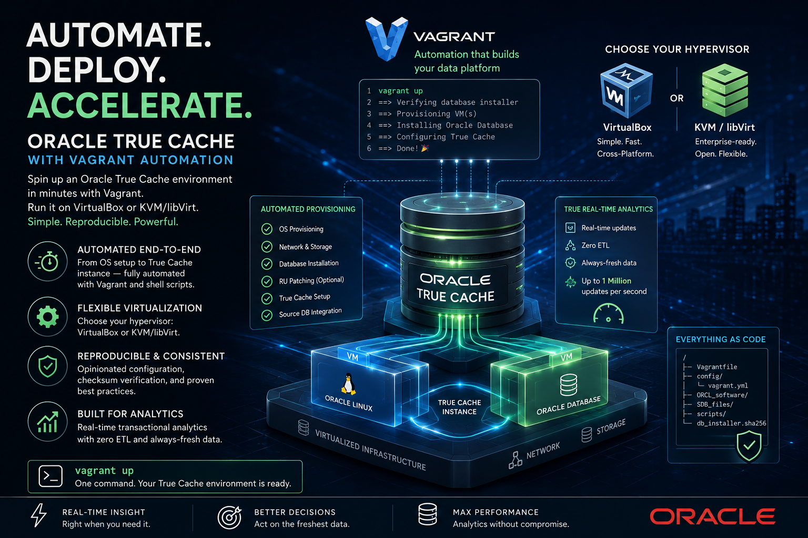

# Oracle TrueCache Vagrant boxes on VirtualBox or KVM/libVirt provider

###### Author: Ruggero Citton (<ruggero.citton@oracle.com>) - Oracle RAC Pack, Cloud Innovation and Solution Engineering Team

This directory contains Vagrant build files to provision automatically
an Oracle True Cache (Oracle Database 26ai, 23.26.1) instance, using Vagrant,
Oracle Linux 9 and shell scripts.

The virtualization provider can be VirtualBox or KVM/libVirt

The provisioning is opinionated about integrity: before any VM boots, the
`Vagrantfile` verifies the installer zip against `db_installer.sha256`
(SHA-256 + a readable-zip check) so a truncated or wrong download fails fast on
the host. Optionally it can also apply a Database Release Update (RU) to the
RDBMS home before the True Cache instance is created — see
[Optional patching](#optional-patching-release-update) below.

## Prerequisites for VirtualBox
1. Install [Oracle VM VirtualBox](https://www.virtualbox.org/wiki/Downloads)
2. Install [Vagrant](https://vagrantup.com/)
3. You need to download Database binary separately

## Prerequisites for KVM/libVirt provider
1. Install [KVM]/[libVirt]
2. Install [Vagrant](https://vagrantup.com/)
3. Install extra packages such ruby-devel libvirt-devel
  - `yum install -y ruby-devel libvirt-devel`
4. Install vagrant-libvirt as user
  - `vagrant plugin install vagrant-libvirt`
5. You need to download Database binary separately

#### Note: *Using KVM/libVirt provider you may need to disable or manage host firewall to permit NFS traffic with the guest VMs*
#### Note: if you are going to use KVM on OL7/OL8 please read 'https://blogs.oracle.com/linux/getting-started-with-the-vagrant-libvirt-provider-for-oracle-linux'

## Free disk space requirement
- Database binary zip under "./ORCL_software": ~2.3 Gb
- Database binary on u01 vdisk (node1) : ~6.5 Gb
- OS guest vdisk (node1): ~2 Gb
  - In case of KVM/libVirt provider, the disks are created under `storage pool = "storage_pool_name"`
  - In case of VirtualBox
    - Use `VBoxManage list systemproperties |grep folder` to find out the current VM default location
    - Use `VBoxManage setproperty machinefolder <your path>` to set VM default location
- Database DBFs virtual disks (dynamic size): ~10 Gb

## 📦 Shared installer repository (`_ORCL_software/`)

The Oracle installer zips are multi-GB and identical across labs. Instead of
copying them into this project's `ORCL_software/`, you can drop each zip
**once** into the shared repository at the root of the Vagrant tree
([`_ORCL_software/`](../../_ORCL_software/README.md)). Every lab resolves
each zip **central-first, then this project's `ORCL_software/`** (which still
works and overrides the shared copy). Inside the guest the repo is mounted
read-only at `/software`.

| Where you put the zip | Effect |
|-----------------------|--------|
| `_ORCL_software/` | Shared by **all** labs — no duplication |
| this project's `ORCL_software/` | Used here only, **overrides** the shared copy |
| *(repo empty / absent)* | Behaves exactly as before |

Point the labs at a different location with `export ORCL_SOFTWARE_REPO=/path`.

## Memory requirement
Running RDBMS node at least 6Gb are required

## Getting started
1. Clone this repository `git clone https://github.com/oracle/vagrant-projects.git`
2. Change into the `OracleTC/23.26.1` folder
3. Download Database binary from OTN into `./ORCL_software` folder (*)
4. Record the installer checksum in `db_installer.sha256` (**)
5. Copy the source Database password file into `./SDB_files`
6. Add a tnsnames.ora entry for the True Cache instance on the source Database
7. Run `vagrant up`
8. Connect to the host issuing: `vagrant ssh vm1`.
9. You can shut down the box via the usual `vagrant halt` and start it up again via `vagrant up`

(*) Download Database binary from OTN into the `ORCL_software` folder

https://www.oracle.com/database/technologies/oracle-database-software-downloads.html

    Accept License Agreement
    go to the Oracle Database 26ai (23.26.1) for Linux x86-64 you need, example

    * Oracle Database 26ai (23.26.1) for Linux x86-64
       LINUX.X64_2326100_db_home.zip

(**) The `Vagrantfile` verifies the installer against `db_installer.sha256`
before booting any VM. Generate the digest and add it to the manifest,
replacing the placeholder path with `/vagrant/...`:

    sha256sum ORCL_software/LINUX.X64_2326100_db_home.zip
    # Windows PowerShell:
    Get-FileHash -Algorithm SHA256 ORCL_software\LINUX.X64_2326100_db_home.zip

## Customization
You can customize your Oracle environment by amending the parameters in the configuration file: "./config/vagrant.yml"
The following can be customized:

#### vm1
- `vm_name`:           VM Guest OS hostname (set to <prefix_name>-<vm_name>). The hypervisor VM name is <prefix_name>-vm1
- `mem_size`:          VM Guest memory size Mb (minimum 6Gb --> 6144)
- `cpus`:              VM Guest virtual cores
- `public_ip`:         VM public ip. VirtualBox `vboxnet0` hostonly is in use
- `private_ip`:        VM private ip.
- `storage_pool_name`: KVM/libVirt storage pool name
- `u01_disk`:          VirtualBox Oracle binary virtual disk (u01) file path

#### shared network

- `prefix_name`      : VM Guest prefix name (the GI cluster name will be: <prefix_name>-c')
- `network`          : It can be 'hostonly' or 'public'.
  - In case of 'hostonly', the guest VMs are using "host-Only" network defined as 'vboxnet0'
  - In case of 'public' a bridge network will be setup ('netmask' and 'gateway' are required). During startup the bridge network is required
- `bridge_nic`       : KVM/libVirt bridge NIC, required in case of 'public' network
- `netmask`          : Required in case of 'public' network
- `gateway`          : Required in case of 'public' network
- `dns_public_ip`    : Required in case of 'public' network
- `domain`           : VM Guest domain name

#### DB storage
- `storage_pool_name`: KVM/libVirt Oradata dbf KVM storage pool name
- `oradata_disk_path`: VirtualBox Oradata dbf path
- `oradata_disk_num` : Oradata number of disks
- `oradata_disk_size`: oradata disk size (Gb)

#### environment
- `provider`:           It's defining the provider to be used: 'libvirt' or 'virtualbox'
- `db_software`:        Oracle Database 26ai (23.26.1) for Linux x86-64 zip file
- `opatch_software`:    Optional OPatch zip (bug 6880880) — set together with `db_ru_software` to patch the home
- `db_ru_software`:     Optional Database Release Update zip — applied before the True Cache instance is created
- `root_password`:      VM Guest root password
- `oracle_password`:    VM Guest oracle password
- `ora_languages`:      Oracle products languages
- `sdb_host_name`:      Suorce database host name/ip
- `sdb_service_name`:   Suorce database service name
- `sdb_service_port`:   Suorce database service port (default 1521)
- `db_files`:           Truecache instance files parameter (default 200)
- `db_unique_name`:     Truecache instance unique name
- `instance_name`:      Truecache instance name
- `fal_server`:         Source database service name (default 'sdb_service_name')
- `fal_client`:         Truecache instance (default 'instance_name')
- `local_listener`:     Truecache instance locallistener
- `sga_target`:         Truecache instance SGA target (Gb) (default 70% 'mem_size')

#### VirtualBox provider Example:
    vm1:
      vm_name: mydb
      mem_size: 8192
      cpus: 2
      public_ip:  192.168.56.60
      private_ip: 192.168.200.60
      u01_disk: ./primary_u01.vdi
    
    env:
      provider: virtualbox
      # ---------------------------------------------
      prefix_name:   tc-234-ol9
      # ---------------------------------------------
      network:       hostonly
      netmask:       
      gateway:       
      dns_public_ip: 
      domain:        localdomain
      bridge_nic:    
      # ---------------------------------------------
      dns_public_ip: 192.168.178.1
      # ---------------------------------------------
      storage_pool_name: Vagrant_KVM_Storage
      oradata_disk_num:   2
      oradata_disk_size: 10
      # ---------------------------------------------
      db_software:     LINUX.X64_2326100_db_home.zip
      # Optional Release Update — set BOTH keys, or neither:
      #opatch_software: p6880880_230000_Linux-x86-64.zip
      #db_ru_software:  p<bug-number>_230000_Linux-x86-64.zip
      # ---------------------------------------------
      root_password:   welcome1
      oracle_password: welcome1
      # ---------------------------------------------
      ora_languages:   en,en_GB
      # ---------------------------------------------
      sdb_host_name:       192.168.125.60
      sdb_service_name:    ORCL
      sdb_service_port:    1521
      #
      db_files:            200
      db_unique_name:      DB234H1_TC
      instance_name:       DB234H1_TC1
      fal_server:          DB234H1
      fal_client:          DB234H1_TC
      local_listener:      DB234H1_TC
      sga_target:          6
      # ---------------------------------------------
    
#### KVM/libVirt provider Example:
    # -----------------------------------------------
    # vagrant.yml for libVirt
    # -----------------------------------------------
    vm1:
      vm_name: truecache
      mem_size: 8192
      cpus: 2
      public_ip:  192.168.125.100
      private_ip: 192.168.200.100
      storage_pool_name: Vagrant_KVM_Storage
    
    env:
      provider: libvirt
      # ---------------------------------------------
      prefix_name:   tc26-ol9
      # ---------------------------------------------
      network:       hostonly
      netmask:       
      gateway:       
      dns_public_ip: 
      domain:        localdomain
      bridge_nic:    
      # ---------------------------------------------
      dns_public_ip: 192.168.178.1
      # ---------------------------------------------
      storage_pool_name: Vagrant_KVM_Storage
      oradata_disk_num:   2
      oradata_disk_size: 10
      # ---------------------------------------------
      db_software:     LINUX.X64_2326100_db_home.zip
      # Optional Release Update — set BOTH keys, or neither:
      #opatch_software: p6880880_230000_Linux-x86-64.zip
      #db_ru_software:  p<bug-number>_230000_Linux-x86-64.zip
      # ---------------------------------------------
      root_password:   welcome1
      oracle_password: welcome1
      # ---------------------------------------------
      ora_languages:   en,en_GB
      # ---------------------------------------------
      sdb_host_name:       192.168.125.60
      sdb_service_name:    DB26H1
      sdb_service_port:    1521
      #
      db_files:            200
      db_unique_name:      DB26H1_TC
      instance_name:       DB26H1_TC1
      fal_server:          DB26H1
      fal_client:          DB26H1_TC
      local_listener:      DB26H1_TC
      sga_target:          6
      # ---------------------------------------------

Example for TrueCache required tnsnames.ora entry for source DB host:

    DB26H1_TC =
      (DESCRIPTION =
        (ADDRESS_LIST =
          (ADDRESS = (PROTOCOL = TCP)(HOST = 192.168.125.65)(PORT = 1521))
        )
        (CONNECT_DATA =
          (SERVER = DEDICATED)
          (SID = DB26H1_TC1)
        )
      )

## Optional patching (Release Update)

Patching is opt-in. Set **both** keys in `env` to apply a Database Release
Update to the RDBMS home, or leave both unset to install at base release:

    env:
      opatch_software: p6880880_230000_Linux-x86-64.zip   # OPatch (bug 6880880)
      db_ru_software:  p<bug-number>_230000_Linux-x86-64.zip

- Both zips go under `ORCL_software/` and need an entry in `db_installer.sha256`
  (`sha256sum ORCL_software/<zip>`), same as the base installer.
- The RU is applied with `opatch apply` **before** the True Cache instance is
  created — no instance is running when the binary patch goes on.
- The True Cache node runs a single-instance database home with no Grid
  Infrastructure, so the home is patched directly (no `opatchauto`). This is why
  the key is `db_ru_software` (a standalone Database RU), not the
  `gi_ru_software` combo patch used by the RAC/FPP projects.

## Cleanup

`vagrant destroy` leaves the u01 and oradata virtual disks behind (the u01 disk
is intentionally reused across destroy/up to speed up retries). The
`cleanup/` scripts run `vagrant destroy -f` and then remove those disks for the
configured provider:

    # Linux / macOS
    ./cleanup/cleanup.sh          # prompts for confirmation
    ./cleanup/cleanup.sh -f       # skip the prompt

    # Windows (VirtualBox)
    powershell -ExecutionPolicy Bypass -File .\cleanup\cleanup.ps1 -Force

The scripts also drop the installer verification stamps under `ORCL_software/`;
the next `vagrant up` re-verifies the zip and regenerates them.

## Running scripts after setup
You can have the installer run scripts after setup by putting them in the `userscripts` directory below the directory where you have this file checked out. Any shell (`.sh`) or SQL (`.sql`) scripts you put in the `userscripts` directory will be executed by the installer after the database is set up and started. Only shell and SQL scripts will be executed; all other files will be ignored. These scripts are completely optional.
Shell scripts will be executed as the root user, which has sudo privileges. SQL scripts will be executed as SYS.
To run scripts in a specific order, prefix the file names with a number, e.g., `01_shellscript.sh`, `02_tablespaces.sql`, `03_shellscript2.sh`, etc.

## Note
- `SYSTEM_TIMEZONE`: `automatically set (see below)`
  The system time zone is used by the database for SYSDATE/SYSTIMESTAMP.
  The guest time zone will be set to the host time zone when the host time zone is a full hour offset from GMT.
  When the host time zone isn't a full hour offset from GMT (e.g., in India and parts of Australia), the guest time zone will be set to UTC.
  You can specify a different time zone using a time zone name (e.g., "America/Los_Angeles") or an offset from GMT (e.g., "Etc/GMT-2"). For more information on specifying time zones, see [List of tz database time zones](https://en.wikipedia.org/wiki/List_of_tz_database_time_zones).
- Wallet Zip file location `/tmp/wallet_<pdb name>.zip`.
  Copy the file on client machine, unzip and set TNS_ADMIN to Wallet loc. Connect to DB using Oracle Sql Client or using your App
- Using KVM/libVirt provider you may need add a firewall rule to permit NFS shared folder mounted on the guest

    example: using 'uwf' : `sudo ufw allow to 192.168.121.1` where 192.168.121.1 is the IP for the `vagrant-libvirt` network (created by vagrant automatically)

      virsh net-dumpxml vagrant-libvirt
      <network connections='1' ipv6='yes'>
        <name>vagrant-libvirt</name>
        <uuid>d2579032-4e5e-4c3f-9d42-19b6c64ac609</uuid>
        <forward mode='nat'>
          <nat>
            <port start='1024' end='65535'/>
          </nat>
        </forward>
        <bridge name='virbr1' stp='on' delay='0'/>
        <mac address='52:54:00:05:12:14'/>
        <ip address='192.168.121.1' netmask='255.255.255.0'>
          <dhcp>
            <range start='192.168.121.1' end='192.168.121.254'/>
          </dhcp>
        </ip>
      </network>
- If you are behing a proxy, set the following env variables

    #### (Linux/MacOSX)
    - export http_proxy=http://proxy:port
    - export https_proxy=https://proxy:port

    #### (Windows)
    - set http_proxy=http://proxy:port
    - set https_proxy=https://proxy:port
