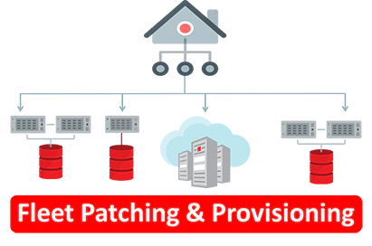

# Working with Fleet Patching and Provisioning
<table class="tbl-heading"><tr>
</td>
<td class="td-banner">
Last Updated: April 27, 2020
</td></tr><table>

Oracle’s Fleet Patching and Provisioning(FPP), formerly known as Rapid Home Provisioning(RHP), standardizes and simplifies software distribution and management.  Automation and efficiency minimize the impact of maintenance and scale to large deployments.

Fleet Patching andProvisioning represents a standard method for provisioning, patching and upgrading the Oracle Database estate in a unified manner across an entireenterprise.It enables and enforces standardization while simplifying provisioning, patching and upgrading.

Software need be installed only once, then stored on the FPP Server, and from there can be provisioned to any node or cluster in the data center, whenever needed. Thus, minimizing the impact and risk of maintenance, increasing automation and reducing touch points, all while supporting large scale deployments.

## Workshop - RunBook
These hands-on lab guides provide step-by-step directions to setting up and using your dedicated Fleet Patching and Provisioning(FPP) environment running on VirtualBox.

## Goals for this workshop
- Import some FPP GoldImages from different source and for different software home (RDBMS, GI, Goldengate)
- Deploy related workingcopies to a target
- Setup a database to a target
- How to make an useraction and attach into a FPP workflow
- How to perform a grid infrastructure upgrade
- How to perform a database upgrade
- How to patch a database home
- ....

## Before You Begin
You should setup an FFP test environment leveraging on Vagrant as documented on

**You are all set, let's begin!**

## Lab 1: Import some FPP GoldImages from different source and for different software home

**Key Objectives**:
- Import a GI goldimage
- Import a RDBMS goldimage
- Import a Goldengate goldimage

**[Click here to run Lab 1](ImportGoldImage.md)**

## Lab 2: Deploy workingcopies

**Key Objectives**:
...

**[Click here to run Lab 1](DeployWorkingcopies.md)**
