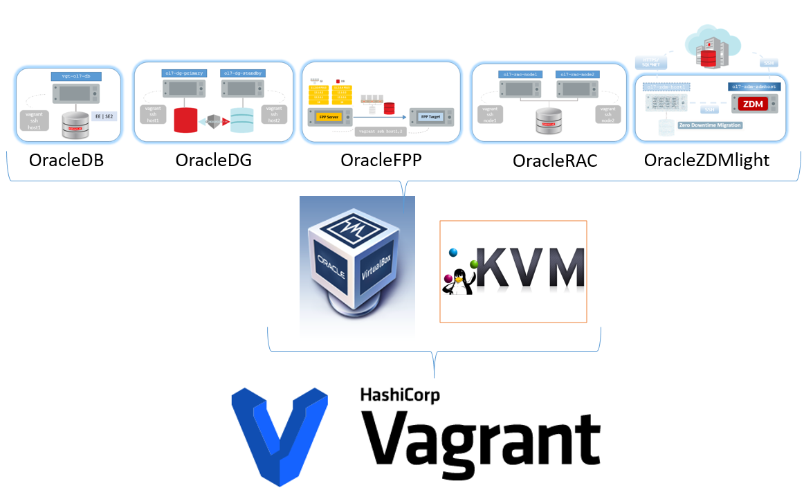

# Oracle Products Vagrant boxes for VirtualBox or KVM/libVirt provider

###### Author: Ruggero Citton (<ruggero.citton@oracle.com>) 
Oracle RAC Pack, Cloud Innovation and Solution Engineering Team

This directory contains Vagrant build files to provision automatically (within one command: "<em>vagrant up</em>"):

- [(DB)  Oracle Database EE or SE2](https://github.com/oracle/vagrant-boxes/RACPack/OracleDB)
- [(DG)  Oracle Dataguard](https://github.com/oracle/vagrant-boxes/RACPack/OracleDG)
- [(FPP) Oracle Fleet Patching and Provisioning](https://github.com/oracle/vagrant-boxes/RACPack/OracleFPP)
- [(RAC) Oracle Real Application Cluster](https://github.com/oracle/vagrant-boxes/RACPack/OracleRAC)

    The virtualization provider can be VirtualBox or KVM/libVirt
